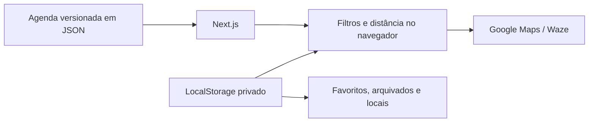

<div align="center">
  <h1>⛪ Casas de Oração</h1>
  <h3>Brasília & Águas Lindas</h3>
  <p>Encontre o próximo culto por dia, período e distância.<br />Mais perto. Mais simples. Direto ao caminho.</p>
  <p>
    <a href="package.json"></a>
    <a href="https://nextjs.org/"></a>
    <a href="https://react.dev/"></a>
    <a href="https://www.typescriptlang.org/"></a>
    <a href="https://vercel.com/"></a>
    <a href="LICENSE"></a>
  </p>
  <p>
    <a href="#-funcionalidades">Funcionalidades</a> •
    <a href="#-dados-e-manutenção">Dados</a> •
    <a href="#-instalação-local">Instalação</a> •
    <a href="#-deploy-na-vercel">Deploy</a> •
    <a href="#-créditos">Créditos</a>
  </p>
</div>

---

## 📌 Sobre o projeto

Aplicação web focada nas casas de oração da Congregação Cristã no Brasil no **Distrito Federal** e em **Águas Lindas de Goiás**. A experiência elimina a navegação repetitiva do relatório nacional: o dia atual já vem selecionado, os filtros ficam salvos e os resultados aparecem em ordem de distância.

O projeto funciona sem cadastro e sem banco de dados. A agenda pública fica versionada em JSON; favoritos, arquivados, filtros e locais pessoais ficam somente no `localStorage` do navegador do usuário.

> **Cobertura atual:** 137 casas de oração e 461 horários de culto/RJM, conferidos em 26/08/2026.

## ✨ Funcionalidades

| Área | Recursos disponíveis |
| --- | --- |
| 📍 **Localização** | GPS do aparelho, cadastro de endereços pessoais e seleção persistente do ponto de saída |
| 🧭 **Distância** | Cálculo local pela fórmula de Haversine e ordenação da casa mais próxima para a mais distante |
| 📅 **Agenda** | Filtro por dia da semana e seleção automática do dia atual |
| 🌅 **Período** | Manhã, tarde, noite ou todos, com identificação automática pelo horário |
| ⛪ **Serviços** | Culto oficial e Reunião de Jovens e Menores apresentados diretamente no card |
| 👥 **Detalhes** | Ministério, telefones e agenda completa exibidos ao abrir cada casa de oração |
| ⭐ **Favoritos** | Seleção privada e persistente, com área dedicada |
| 🗄️ **Arquivados** | Oculta casas das buscas, permite restaurar individualmente ou desarquivar todas |
| 🚗 **Rotas** | Google Maps e Waze recebem a denominação e o endereço oficial completos, sem usar coordenadas aproximadas |
| 🔎 **Busca** | Pesquisa instantânea por casa, bairro, cidade ou endereço |
| 🔐 **Privacidade** | Nenhuma conta, cookie de rastreamento ou dado pessoal enviado para um banco |

## 🧱 Decisão de arquitetura

Um banco de dados não é necessário para este escopo. Os dados públicos mudam pouco e são mantidos em [`data/churches.json`](data/churches.json), enquanto preferências pessoais pertencem somente ao dispositivo. Isso reduz custo, manutenção, superfície de segurança e dependência de serviços externos.



## 🗺️ Dados e manutenção

Os dados foram cruzados com o [Relatório oficial da CCB](https://congregacaocristanobrasil.org.br/relatorio) e páginas de consulta derivadas do Relatório Digital. O script de atualização cobre todas as 23 localidades cadastradas do DF, além de Águas Lindas de Goiás.

Para atualizar a base:

```bash
npm run data:update
```

O atualizador consulta cada código diretamente no relatório oficial, confere a correspondência e só então grava endereço, agenda, ministério e telefones. Para executar as verificações de integridade da base e dos links:

```bash
npm run data:validate
```

O comando atualiza [`data/churches.json`](data/churches.json), preservando código, endereço, agenda, coordenadas e URL de origem. Antes de publicar, revise o diff do arquivo e confirme mudanças relevantes no relatório oficial.

Para adicionar ou corrigir uma casa manualmente, mantenha o formato existente:

```json
{
  "id": "BR-24-0000",
  "name": "Nome da localidade",
  "city": "Brasília",
  "state": "DF",
  "address": "Endereço completo",
  "services": [{ "day": "Dom", "time": "19:00", "type": "Culto oficial" }],
  "latitude": -15.0,
  "longitude": -47.0
}
```

## 🛠️ Tecnologias

- **Next.js 16** com App Router.
- **React 19** e **TypeScript**.
- **Tailwind CSS 4** e CSS responsivo próprio.
- **Lucide React** para iconografia acessível.
- **LocalStorage** para preferências privadas.
- **OpenStreetMap Nominatim** para localizar endereços pessoais.
- **Vercel** como destino de produção.

## 🚀 Instalação local

```bash
git clone https://github.com/RDEsley/Relatorio-CCB-Brasilia.git
cd Relatorio-CCB-Brasilia
npm ci
npm run dev
```

Acesse [http://localhost:3000](http://localhost:3000).

### Comandos úteis

| Comando | Finalidade |
| --- | --- |
| `npm run dev` | Inicia o ambiente de desenvolvimento |
| `npm run build` | Gera o build otimizado |
| `npm run lint` | Verifica a qualidade do código |
| `npm run data:update` | Atualiza a agenda das casas de oração |
| `npm run data:validate` | Valida escopo, fonte, códigos, coordenadas e rotas |

## ☁️ Deploy na Vercel

1. Importe este repositório na Vercel.
2. Mantenha o framework **Next.js** detectado automaticamente.
3. Não é necessário cadastrar variáveis de ambiente.
4. Publique o projeto.

O [`vercel.json`](vercel.json) já configura a região de São Paulo. Previews de pull requests também funcionam sem serviços externos.

## 🔐 Privacidade e limites

- Nenhuma localização pessoal é enviada ao projeto ou armazenada em servidor.
- Ao cadastrar um endereço, a busca de coordenadas usa o serviço público Nominatim.
- Limpar os dados do navegador remove favoritos, arquivados e locais salvos.
- Agendas podem mudar por reformas, eventos ou decisões locais; confirme alterações no relatório oficial.
- Este é um projeto independente e não representa oficialmente a Congregação Cristã no Brasil.

## 🤝 Contribuição

Contribuições são bem-vindas, especialmente correções de endereço e horário. Abra uma issue com a fonte da informação ou envie um pull request pequeno e objetivo.

## 📄 Licença

Distribuído sob a licença MIT. Consulte [`LICENSE`](LICENSE).

---

## 👨‍💻 Créditos

<div align="center">
  <a href="https://github.com/RDEsley">
    
  </a>
  <h3>Richard Oliveira</h3>
  <p><strong>Desenvolvimento e arquitetura de software</strong></p>
  <p>
    <a href="https://github.com/RDEsley"></a>
    <a href="mailto:richardesleyso@gmail.com"></a>
  </p>
</div>
